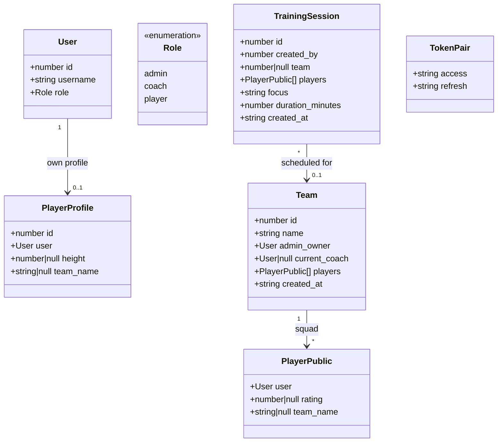
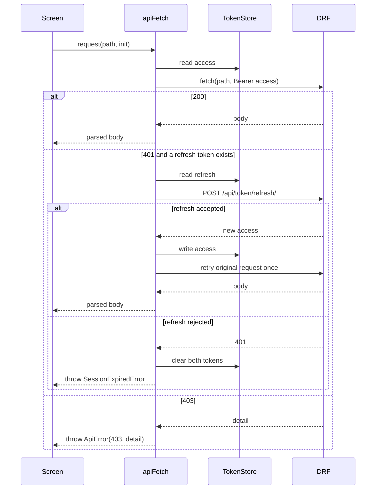
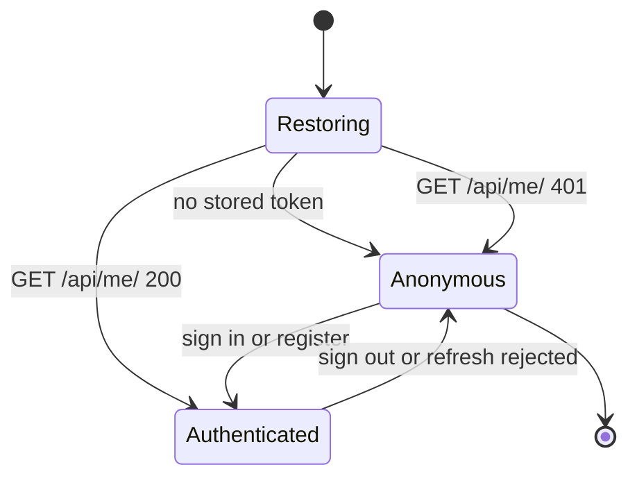
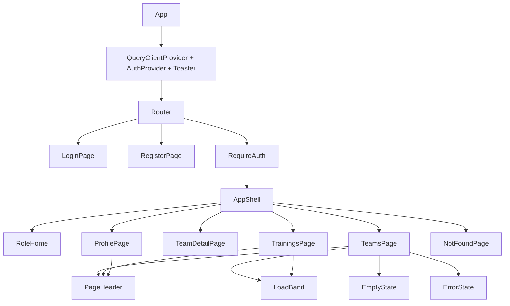

# Design — `web` (the React client)

**Status:** `agreed` · **Owner:** Katlego (Claude) ·
**Tasks:** `T001–T012` · **Spec:** [SPEC.md](../../SPEC.md) `US1–US5`

---

## 1. What this covers

The browser client in `apps/web/`: authentication against the DRF token endpoints, the role-aware
shell, and the three working surfaces (teams, training sessions, own profile). It is a pure
consumer — it holds no domain rules of its own, and every authorisation decision stays server-side.
The client's job when the API says 403 is to show what the API said, not to pre-empt it.

It does **not** cover the API itself (that is `backend/`, and the only change this lane made there
is `GET /api/me/` — §8), nor mobile clients, nor deployment.

## 2. Reference material

| Kind | Where |
| --- | --- |
| Design system / tokens | `apps/web/src/index.css` — the `:root` / `.dark` token blocks are the visual reference. Every colour, face, radius and motion value in the app resolves to one of them; a component that hard-codes a hex is a defect. |
| Visual direction | §2.1 below — the written direction the tokens implement |
| Existing code this must match | `backend/api/views.py`, `backend/api/serializers.py`, `backend/api/permissions.py` — the contract in §6 is read off these, not from README.md |
| Component layer | `apps/web/src/components/ui/*` — shadcn/ui (`base-nova` style), treated as unstyled structure |

### 2.1 Visual direction — the shadcn UI Kit "academy" theme

The direction is **specified by the brief**: match the academy dashboard at
<https://shadcnuikit.com/dashboard/academy>. Its tokens were read off that site's stylesheet
(`dashboard.shadcnuikit.com/_next/static/chunks/*.css`) rather than eyeballed, and ported verbatim
into `apps/web/src/index.css`. When the brief pins the direction, the brief wins — there is no
independent aesthetic to invent here, only a theme to reproduce faithfully.

| Axis | Choice |
| --- | --- |
| **Palette** | A single monochrome zinc ramp, `--base-50 #fafafb` → `--base-950 #09090b`, with **no hue anywhere**: `--primary` *is* `--base-950`, so buttons and chart fills are near-black rather than coloured. Light: white content on a `--base-100 #f4f4f6` sidebar. Dark: `--base-950` content on a `--base-900 #18181b` sidebar. Colour is reserved for state alone — `--destructive` `#e40014` light, `#ff6568` dark. |
| **Type** | Geist Variable for everything, Geist Mono for numerals (tabular figures via the `.tabular` utility). Self-hosted through `@fontsource-variable`. |
| **Radius** | `0.5rem`, with the kit's derived `--radius-sm…4xl` ramp. |
| **Layout** | A collapsible left sidebar (`SidebarProvider` / `SidebarInset`) at `16rem`, collapsing to a `3rem` icon rail, with a sticky 56px content header carrying the trigger, the page title, the theme toggle and sign out. Content is card-based: a `PageHeader`, a row of `StatTile`s, then a `Card` wrapping a `Table`. |
| **Signature** | **The load band.** Every list row draws its own datum against the largest in the same view — `duration_minutes` on sessions, squad size on teams, rating on players. Rendered in `--chart-1` (the darkest base step) on a `--muted` track, so it reads as data rather than as an accent. It draws real data or it doesn't render; there is no decorative variant, and it is absent from the profile screen because one player has nothing to compare against. |
| **Motion** | Bands grow from zero on mount, 300ms ease-out, staggered 24ms per row. Everything else is a short colour transition. `prefers-reduced-motion` collapses both. |

## 3. Domain model

The client mirrors the server's shapes exactly. Fields absent here do not exist client-side; if one
is needed, this document changes before the code does.



**Notes the diagram can't carry**

- `height` is a float in metres or centimetres — the API does not say which and does not validate
  it, so the client renders the number the API returned and labels the field `Height`, without
  inventing a unit. Resolving this is an open question (§10).
- `rating` is an integer, nullable, and is **read-only to this client** — no endpoint accepts it.
- `PlayerPublic` carries no `id`, which is why players cannot be assigned from the UI (§8).
- `created_at` is an ISO-8601 string; the client formats it, never parses it into domain logic.

## 4. Flow

The one flow with real failure modes is the access-token lifecycle. `SIMPLE_JWT` gives an access
token 30 minutes and a refresh token 1 day, so a session that outlives a tab reload is normal and
mid-session expiry is expected, not exceptional.



**Failure paths**

- **Concurrent 401s.** Several queries can fail at once on the same expired token. The refresh is
  **single-flight**: the first 401 starts it, every other caller awaits the same promise, and the
  original request is retried at most once. Without this, N parallel requests burn N refresh
  round-trips and can race each other into a cleared store.
- **`SessionExpiredError`** clears the store and the auth context drops to signed-out; the router
  sends the user to `/login`. It is never surfaced as a toast — an expired session is not an error
  the user did anything about.
- **403** is surfaced verbatim from the API's `detail`. The client does not translate it, soften it,
  or hide the control that produced it — the server is the authority on who may do what, and a UI
  that guesses ahead of it will eventually guess wrong in the permissive direction.
- **Network failure** throws `ApiError(0, …)` and the screen shows a retry, not an empty state.
  An empty list and a failed request must never look the same.

## 5. State

The session the whole shell is gated on:



`Restoring` renders a skeleton, never the login screen — flashing `/login` at a signed-in user
reloading a page is the bug this state exists to prevent. There is no `Refreshing` state: the
refresh is invisible to the UI by design (§4).

## 6. Contracts

Read off `backend/api/urls.py`, `views.py`, `serializers.py` and `permissions.py`. Base URL comes
from `VITE_API_BASE_URL` (default `http://127.0.0.1:8000`).

| Method | Path | Body | 200/201 | Who the server lets in |
| --- | --- | --- | --- | --- |
| POST | `/api/token/` | `{username, password}` | `{access, refresh}` | anyone |
| POST | `/api/token/refresh/` | `{refresh}` | `{access}` | anyone with a live refresh token |
| POST | `/api/auth/register/{admin\|coach\|player}/` | `{username, email, password, password2}` | `{user, access, refresh}` | anyone |
| GET | `/api/me/` | — | `{id, username, role}` | any authenticated user |
| GET | `/api/coaches/` | — | `User[]` (`role='coach'`) | `IsAdminOrCoach` — **players get 403** |
| GET | `/api/players/` | — | `PlayerPublic[]` | `IsAdminOrCoach` — **players get 403** |
| GET | `/api/profiles/` | — | `PlayerProfile` | authenticated; **404 unless the user has a profile**, i.e. players only |
| PATCH | `/api/profiles/` | `{height?}` | `PlayerProfile` | same |
| GET | `/api/teams/` | — | `Team[]` | `IsAdminOrCoach` — **players get 403** |
| POST | `/api/teams/` | `{name, current_coach?, players?}` | `{id, name, current_coach, players}` | `IsAdminOrCoach` |
| GET | `/api/teams/{id}/` | — | `Team` | any authenticated user (see §10) |
| PATCH | `/api/teams/{id}/` | `{name?, current_coach?, players?}` | write shape | `admin_owner` only |
| DELETE | `/api/teams/{id}/` | — | 204 | `admin_owner` only |
| GET | `/api/trainings/` | — | `TrainingSession[]` | `IsAdminOrCoach` — **players get 403** |
| POST | `/api/trainings/` | `{focus, duration_minutes, team?, players?}` | write shape | `IsAdminOrCoach`; `team` must be one the caller owns |
| PATCH | `/api/trainings/{id}/` | `{focus?, duration_minutes?, team?}` | write shape | admin/coach |
| DELETE | `/api/trainings/{id}/` | — | 204 | admin/coach |

TypeScript equivalents live in `apps/web/src/lib/types.ts` and are the single copy — no screen
redeclares a response shape.

```ts
export type Role = 'admin' | 'coach' | 'player'
export interface User { id: number; username: string; role: Role }
export interface PlayerPublic { id: number; user: User; rating: number | null; team_name: string | null }  // id = PlayerProfile pk
export interface PlayerProfile { id: number; user: User; height: number | null; team_name: string | null }
export interface Team { id: number; name: string; admin_owner: User; current_coach: User | null; players: PlayerPublic[]; created_at: string }
export interface TrainingSession { id: number; created_by: number; team: number | null; players: PlayerPublic[]; focus: string; duration_minutes: number; created_at: string }
```

### The two directories, and why they exist

`TeamWriteSerializer.current_coach` takes a `User` pk and `players` takes `PlayerProfile` pks, but
until `T013`/`T014` nothing let a client discover either number — and `PlayerPublicSerializer` did
not expose `id` at all, so a squad could be rendered and never edited. Both gaps are closed:

- **`GET /api/coaches/`** — `UserSerializer` over `role='coach'`, ordered by username.
- **`GET /api/players/`** — `PlayerPublicSerializer` over every profile, now including `id`.

Both are **staff-only** (`IsAuthenticated + IsAdminOrCoach`). Enumerating athletes' profiles is a
privacy decision, and the answer is that only admins and coaches may; a player reaches their own
profile through `/api/profiles/` and sees nobody else's. Tightening `coaches` to admin-only later is
a one-line change to `permission_classes`.

**`PlayerPublic.id` is the profile pk, not `user.id`.** They are different numbers for the same
person, and sending the wrong one assigns somebody else without the API objecting — which is why
`PlayerPicker` carries a test asserting exactly that.

## 7. Structure

| Path | New? | Responsibility |
| --- | --- | --- |
| `apps/web/src/index.css` | new | the token system (§2.1); the only place a colour is defined |
| `apps/web/src/lib/types.ts` | new | the §6 contract, once |
| `apps/web/src/lib/tokens.ts` | new | access/refresh persistence + change notification |
| `apps/web/src/lib/api.ts` | new | `apiFetch`, `ApiError`, `SessionExpiredError`, single-flight refresh |
| `apps/web/src/lib/format.ts` | new | duration, date and height formatting — shared, not per-screen |
| `apps/web/src/auth/AuthProvider.tsx` | new | the §5 state machine; `signIn`, `register`, `signOut` |
| `apps/web/src/auth/useAuth.ts` | new | context hook |
| `apps/web/src/auth/guards.tsx` | new | `RequireAuth`, `RequireRole`, `RoleHome` |
| `apps/web/src/api/queries.ts` | new | TanStack Query hooks, one per §6 row that a screen uses |
| `apps/web/src/components/LoadBand.tsx` | new | the signature element |
| `apps/web/src/components/PlayerPicker.tsx` | new | choose profiles for a squad or a session; emits PlayerProfile pks |
| `apps/web/src/components/PageHeader.tsx` | new | screen title, one line of orientation, the primary action, and the `StatTile` |
| `apps/web/src/components/EmptyState.tsx` | new | invitation copy for a genuinely empty list |
| `apps/web/src/components/ErrorState.tsx` | new | failed request + retry (never confused with empty) |
| `apps/web/src/components/AppShell.tsx` | new | nav lanes, identity chip, theme toggle, sign out |
| `apps/web/src/components/ThemeToggle.tsx` | new | sheet ⇄ onyx, persisted |
| `apps/web/src/pages/LoginPage.tsx` | new | US1 |
| `apps/web/src/pages/RegisterPage.tsx` | new | US2 — role is chosen here because the endpoint is per-role |
| `apps/web/src/pages/TeamsPage.tsx` | new | US3 list + create |
| `apps/web/src/pages/TeamDetailPage.tsx` | new | US3 rename, delete, squad |
| `apps/web/src/pages/TrainingsPage.tsx` | new | US4 list, create, edit, delete |
| `apps/web/src/pages/ProfilePage.tsx` | new | US5 |
| `apps/web/src/pages/NotFoundPage.tsx` | new | unmatched route |



`ProfilePage` deliberately carries **no** load band: a band is only meaningful against the largest
value in the same view, and one player's own profile has nothing to compare against. Drawing one
there would be decoration wearing the signature element's clothes.

## 8. Decisions & alternatives

| Decision | Chosen | Rejected, and why |
| --- | --- | --- |
| How the client learns the user's role | `GET /api/me/`, added in this lane | Decoding the JWT client-side — SimpleJWT's payload carries `user_id`, not `role`, so there is nothing to decode. Probing `/api/profiles/` for a 404 would distinguish players from staff but never admin from coach, and builds a permission inference into the client, which Non-negotiable I forbids. |
| Auth-class ordering in DRF | JWT before Session | Leaving Session first returned 403 for an expired token, indistinguishable from a role denial, which makes correct refresh logic impossible. No permission check changed — only the status code for *unauthenticated* callers. |
| Token storage | `localStorage` | In-memory only would sign the user out on every reload with a 1-day refresh token available. httpOnly cookies are the stronger answer and need a backend session/cookie strategy this lane does not own — recorded as a risk in STATUS.md, not silently accepted as fine. |
| Server state | TanStack Query | Hand-rolled `useEffect` fetching — this app is almost entirely server state, and cache invalidation after a mutation is the whole problem. |
| Component layer | shadcn/ui `base-nova` | Current shadcn/ui ships on **Base UI**, not Radix; `docs/architecture-defaults.md` §3 still says Radix. The default's intent (copy-paste-owned components, Tailwind, CVA) holds exactly; the primitive underneath moved upstream. Deviation recorded here rather than pinning an outdated shadcn. |
| Routing | `react-router` v8 | `react-router-dom` 7.18.1 is inside the advisory range for GHSA-qwww-vcr4-c8h2 and v8 merged the DOM package into `react-router`. |
| Who may enumerate coaches and players | staff only (`IsAdminOrCoach`) | Open to any authenticated user — a player has no use for either list, and athletes' profiles are not public. Admin-only was the other candidate; it would stop a coach building their own squad, which is the job. |
| Fonts | self-hosted `@fontsource-variable/geist` | Geist is the theme's face. A Google Fonts `<link>` would make first paint depend on a third party and leak every user's IP to it. |
| Visual direction | ported from the shadcn UI Kit academy theme | Inventing one. The brief named the theme, so the job is faithful reproduction — tokens were read off its shipped CSS, not approximated by eye. |

Deviations from [docs/architecture-defaults.md](../architecture-defaults.md): the component-layer
primitive (row above), and no `Dockerfile` for this app — it is a static bundle, which
architecture-defaults §4 names as a legitimate exception.

## 9. How this is verified

- `npm run build` in `apps/web` — `tsc -b` proves every screen consumes the §6 types, not
  invented shapes.
- `npm test` — the refresh flow in §4 (single-flight, retry-once, clear-on-rejection) and the §5
  state machine are unit-tested against a stubbed `fetch`. A test that passes with `apiFetch`
  returning a constant is not a test of this design.
- `python -m pytest` at the repo root — `/api/me/` returns exactly `{id, username, role}` for each
  role and 401 for anonymous.
- Visual: every screen at 375px and 1440px, in both token sets, with keyboard-only focus visible,
  compared against §2.1. A screen that renders a hex not present in `index.css` fails.

## 10. Open questions

- [x] ~~Who may enumerate coaches and player profiles?~~ Resolved: staff only, and `T013`/`T014`
      are built (§6).
- [ ] `PlayerProfile.height` has no unit and no validation. Centimetres or metres — and should the
      API reject a negative one? The client currently displays what it is given.
- [ ] `GET /api/teams/{id}/` is readable by **any** authenticated user, because `IsTeamOwner`
      returns `True` for all safe methods and `TeamDetailView` adds no role check. A player can read
      any club's team by guessing an id. The client never links to a team it did not receive from
      `/api/teams/`, but that is not a fix — it needs deciding server-side.
- [ ] A coach who creates a team becomes its `admin_owner` while `current_coach` stays null, and
      `TeamListCreateView` filters a coach's list on `current_coach` — so a coach cannot see the
      team they just created. Product decision, not a client workaround.
